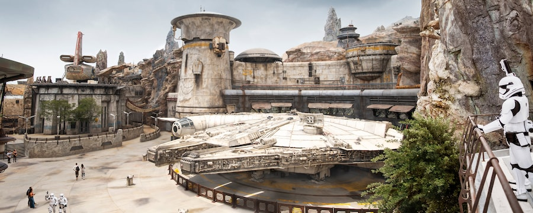
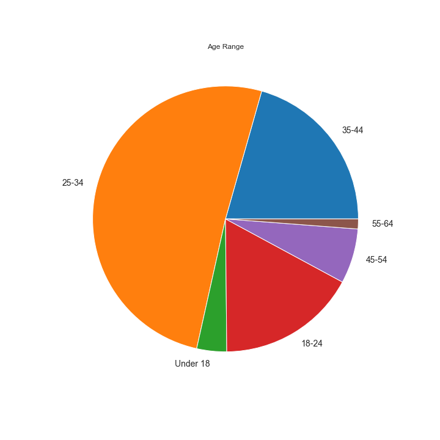
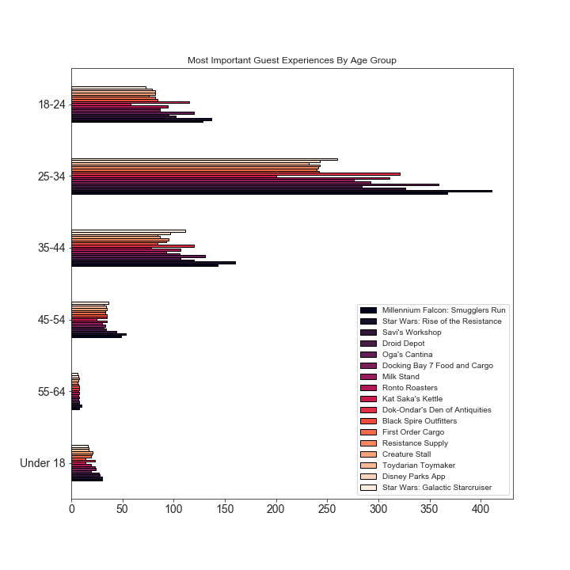
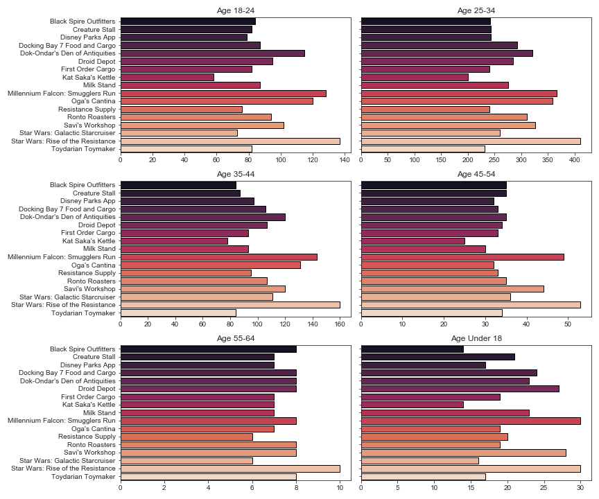
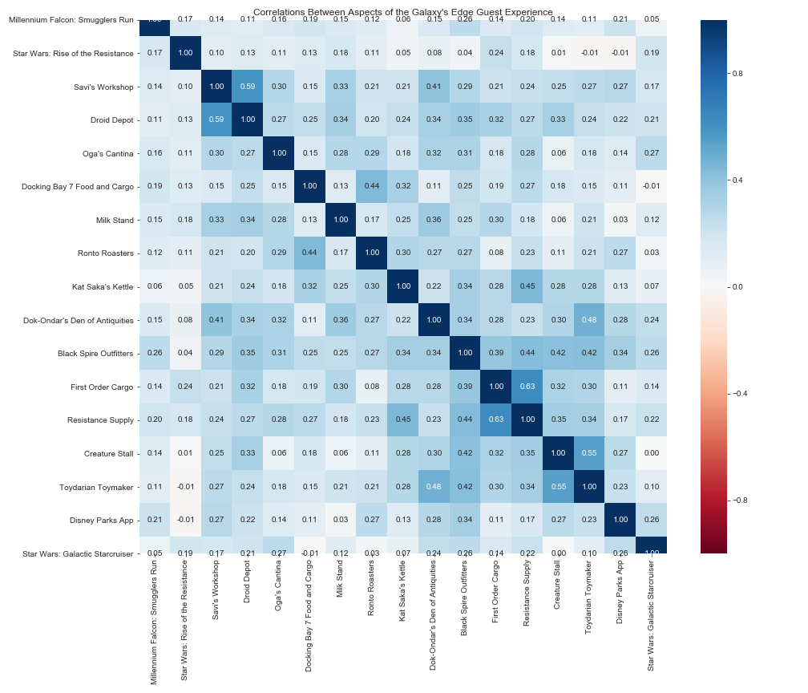
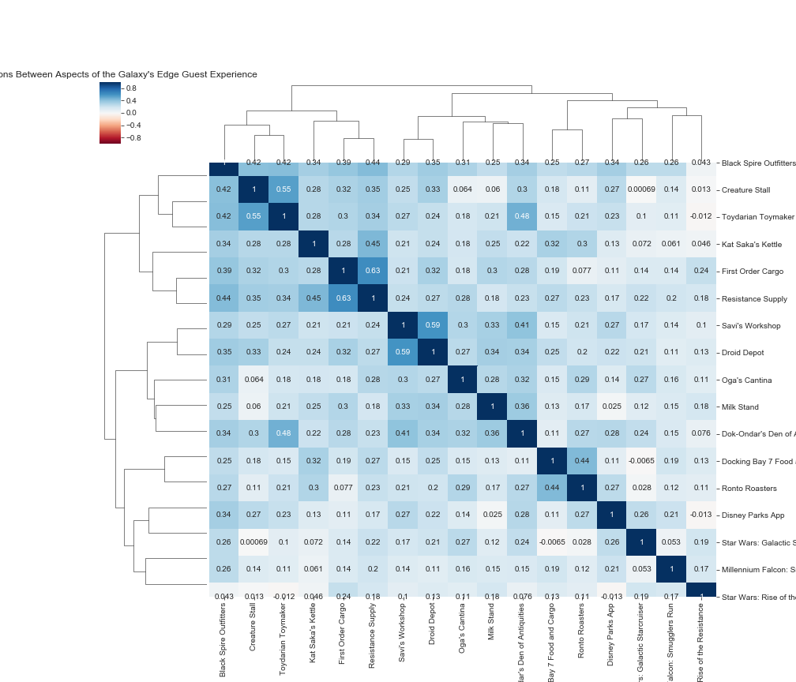

# Star Wars: Galaxy's Edge Guest Experience

This survey was conducted to identifying important correlations in the guest experience at Star Wars: Galaxy's Edge at both Walt Disney World and Disneyland.

## Sample Size Demographics
I personally designed the survey using Google Forms and collected responses from Reddit. The current dataset is small but displays ways of identifying important correlations in the guest experience using survey data. 

## Findings

## Progress
- [x] Create Survey
- [x] Data Collection
- [x] Data Cleaning
- [x] Data Analysis
- [x] Data Visualization
- [x] Data Visulizations by Age Group
- [x] Statistical Testing
